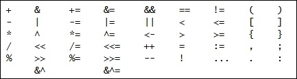

运算符用于执行算数运算并比较。Go语言有以下运算符：

最常用的是算术运算符和比较运算符。算数运算符如下：

 - `+` 表示加；
 - `-` 表示减；
 - `*` 表示乘；
 - `/` 表示除；
 - `%` 表示取余；
 - `++` 表示变量加1；
 - `--` 表示变量减1；

比较运算符用于比较两个元素的差异：
- `==` 表示判断是否相等；
- `!=` 表示判断是否不等；
- `>` 表示判断是否大于；
- `<` 表示判断是否小于；
- `>=` 表示判断是否大于等于；
- `<=` 表示判断是否小于等于；
- `&&` 表示判断两个元素是否都为true；

同时还存在移位运算符和取反运算符。接下来的章节中我们会大量的使用上述运算符，但现在只需要记住，不能把运算符设成变量名、字段名以及函数名。

> 小贴士
>
> 10的倒数是多少？ 10的负值是多少？ -10？ 答案错误。二进制代码中的10是1010，因此如果我们对每一位取反，将得到0101或101，即数字5。
